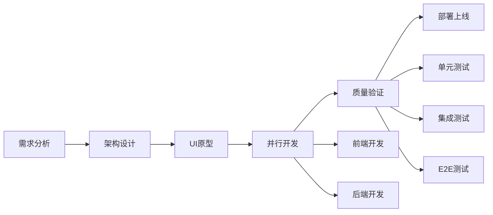

# Human-Orchestrated Multi-Agent Development Framework

> 🤖 Advanced AI-Assisted Software Development with Controlled Multi-Agent Collaboration

一个复杂的多Agent协作开发框架，专为Claude Code设计，实现AI助手与人类开发者的高效协作。

[](https://github.com/your-repo/ho-agent)
[](LICENSE)
[](https://claude.ai/code)

## ✨ 特性

- 🎯 **11个专业化AI Agents** - 从需求分析到部署的全流程覆盖
- 🔄 **8阶段渐进式开发流程** - 从规划到上线的结构化开发过程  
- 🛡️ **多层质量验证系统** - 单元、契约、集成、系统四层质量门控
- 🧠 **智能冲突解决** - 自动检测和解决Agent间的协作冲突
- 👥 **人机协作决策** - 关键决策点的人工介入机制
- 📊 **实时状态管理** - 共享状态数据库追踪所有Agent活动
- 🐳 **完整技术栈** - React + TypeScript + Node.js + Fastify 的现代化技术栈

## 🏗️ 架构概览

```
┌─────────────────────────────────────────────────────────┐
│                   Coordinator Agent                     │
│              (Central Orchestration)                   │
└─────────────────────────┬───────────────────────────────┘
                         │
    ┌────────────────────┼────────────────────┐
    │                    │                    │
┌───▼────┐        ┌─────▼─────┐        ┌────▼────┐
│Planning│        │Development│        │Quality &│
│ Phase  │        │   Phase   │        │Deploy   │
└────────┘        └───────────┘        └─────────┘
    │                    │                    │
    │                    │                    │
┌───▼────┐        ┌─────▼─────┐        ┌────▼────┐
│Requirements│    │Frontend & │        │QA &     │
│Analyst     │    │Backend    │        │DevOps   │
│UX Designer │    │Developers │        │Engineers│
└────────────┘    └───────────┘        └─────────┘
```

## 🤖 AI Agents 详解

### 核心开发 Agents

| Agent | 职责 | 主要工具 | 输出 |
|-------|------|----------|------|
| **Coordinator** | 中央协调器，任务分配，冲突解决 | StateQuery, ConflictResolution | 进度报告，冲突解决方案 |
| **Technical Architect** | 系统架构设计，技术选型 | CodeAnalysis, DiagramGeneration | 架构文档，API规范 |
| **Frontend Developer** | React/TypeScript UI开发 | CodeGeneration, BrowserTesting | UI组件，测试文件 |
| **Backend Developer** | Node.js/Fastify API开发 | CodeGeneration, Testing | API接口，单元测试 |
| **QA Engineer** | 质量验证，测试自动化 | TestAutomation, Validation | 测试报告，质量分析 |

### 支持型 Agents

- **Requirements Analyst**: 需求分析和用户故事编写
- **UX Designer**: 界面设计和用户体验优化
- **Project Manager**: 项目规划和资源管理
- **DevOps Engineer**: 容器化和CI/CD流水线
- **Documentation Writer**: 技术文档和API文档
- **Code Reviewer**: 代码审查和最佳实践

## 🚀 三步快速开始

### 1. 复制框架文件到你的项目

```bash
# 直接复制agents和workflows目录
cp -r ho-agent/agents/ your-project/
cp -r ho-agent/workflows/ your-project/
cp ho-agent/CLAUDE.md your-project/
```

### 2. 在Claude Code中说一句话

```
请使用这个项目中的Multi-Agent开发框架，按照agents/和workflows/中定义的专业分工和8阶段流程来协作开发
```

### 3. 开始协作开发！

```bash
# 复杂任务协调
请 coordinator agent 管理这个电商网站的完整开发流程

# 具体功能开发
请 technical-architect 设计用户认证系统，然后让相关agents实现
```

**就这么简单！** 查看 [USE-WITH-CLAUDE.md](USE-WITH-CLAUDE.md) 了解详细使用方法。

## 📖 使用指南

### 基本用法模式

```bash
# 1. 复杂任务协调
请使用 coordinator agent 来管理这个多模块项目的开发

# 2. 系统设计
请 technical-architect 设计这个微服务架构的API网关

# 3. 前端开发
请 frontend-developer 实现响应式的商品展示页面

# 4. 后端开发
请 backend-developer 创建用户认证和权限管理API

# 5. 质量验证
请 qa-engineer 对整个用户注册流程进行全面测试
```

### 开发流程示例



## ⚙️ 配置说明

### 项目结构

```
your-project/
├── agents/                  # 11个专业AI agents
│   ├── coordinator.md
│   ├── technical-architect.md
│   ├── frontend-developer.md
│   ├── backend-developer.md
│   └── ...（其他7个agents）
├── workflows/               # 开发工作流配置
│   ├── workflow.yaml
│   ├── quality-rules.yaml
│   └── human-intervention.yaml
├── CLAUDE.md               # Claude Code指导文件
└── ...                     # 你的项目文件
```

### 核心配置文件

#### `workflows/workflow.yaml` - 主工作流配置
```yaml
version: "2.0"
name: "Controlled Collaborative Development Workflow"

settings:
  execution_mode: "controlled_parallel"
  max_concurrent_writers: 2
  max_concurrent_readers: 4
  
agents:
  - id: coordinator
    max_instances: 1
    always_active: true
    
execution_phases:
  - phase: 1
    name: "Single Developer Enhancement"
    enabled_agents: [coordinator, requirements-analyst, technical-architect]
```

#### `workflows/quality-rules.yaml` - 质量标准配置
```yaml  
validation_layers:
  unit_validation:
    rules:
      - name: "unit_test_coverage"
        threshold: 80
        severity: "warning"
      - name: "code_complexity"  
        threshold: 10
        severity: "warning"
```

## 🎯 质量保证体系

### 四层验证模型

```
System Level     ┌─────────────────────────────────────────┐
                │ E2E Tests, Security, Performance       │
                └─────────────────┬───────────────────────┘
Integration Level┌─────────────────▼───────────────────────┐
                │ API Integration, Data Flow              │
                └─────────────────┬───────────────────────┘
Contract Level   ┌─────────────────▼───────────────────────┐
                │ Schema Validation, Type Consistency     │
                └─────────────────┬───────────────────────┘
Unit Level       ┌─────────────────▼───────────────────────┐
                │ Unit Tests, Code Quality, Linting      │
                └─────────────────────────────────────────┘
```

### 质量门控标准

- ✅ **单元层**: 80%测试覆盖率，复杂度<10，零Lint错误
- ✅ **契约层**: API模式一致性，数据类型兼容性
- ✅ **集成层**: 95%集成测试通过率，数据流验证
- ✅ **系统层**: 100% E2E测试，无障碍性，安全扫描

## 👥 人工介入机制

### 强制介入点（必须人工批准）
- 📋 **需求和架构评审** - 24小时超时
- 🏗️ **重大架构变更** - 4小时超时  
- 🚀 **生产部署批准** - 8小时超时

### 推荐介入点（可自动继续）
- ⚠️ **多个质量问题** - 1小时后自动继续
- 📈 **性能下降>20%** - 30分钟后自动继续
- 📅 **开发时间超期50%** - 2小时后自动继续

## 🛠️ 技术栈

### 默认技术栈
- **Frontend**: React 18 + TypeScript + Vite + Tailwind CSS + Shadcn/ui
- **Backend**: Node.js + Fastify + TypeScript + Prisma ORM  
- **Database**: PostgreSQL (生产) + SQLite (开发) + Redis (缓存)
- **Testing**: Jest + React Testing Library + Supertest + Playwright
- **Infrastructure**: Docker + Docker Compose + Nginx
- **CI/CD**: GitHub Actions

### 可定制技术栈
框架支持自定义技术栈，只需修改agent配置文件中的技术栈部分。

## 📚 详细文档

- 🚀 **[USE-WITH-CLAUDE.md](USE-WITH-CLAUDE.md)** - ⭐ **一键启用指南（新手必看）**
- 🎯 [CLAUDE.md](CLAUDE.md) - Claude Code的项目指导文件  
- 🤖 [Agent使用说明](AGENT-USAGE-GUIDE.md) - 每个Agent的详细使用方法
- 📖 [项目集成指南](PROJECT-INTEGRATION-GUIDE.md) - 如何集成到现有项目
- ⚡ [工作流设置](WORKFLOW-SETUP.md) - 一键设置脚本和配置指南
- 🧠 [记忆Prompt](MEMORY-PROMPT.md) - 让Claude记住工作流的提示词

## 💡 使用示例

### 🛍️ 电商网站开发（完整流程）

```
# 启用框架后的一条龙开发
请使用Multi-Agent框架开发一个电商网站，包括用户管理、商品展示、购物车、订单处理和支付功能

# Claude会自动：
# 1. coordinator 制定开发计划和任务分工
# 2. requirements-analyst 分析详细需求  
# 3. technical-architect 设计系统架构和API
# 4. ux-designer 设计用户界面
# 5. frontend-developer 和 backend-developer 并行开发
# 6. qa-engineer 进行多层质量验证
# 7. devops-engineer 准备部署环境
```

### 📱 快速原型开发

```
# 单一任务快速实现
请 technical-architect 设计一个用户认证API，然后让 backend-developer 实现，frontend-developer 创建登录界面

# 复杂功能协调开发  
请 coordinator 协调开发实时聊天功能，包括WebSocket连接、消息存储、在线状态显示
```

## 🤝 贡献指南

我们欢迎社区贡献！你可以：

- 🐛 [报告Bug](https://github.com/your-repo/ho-agent/issues)
- 💡 [提出新功能建议](https://github.com/your-repo/ho-agent/issues)  
- 🔧 [提交Pull Request](https://github.com/your-repo/ho-agent/pulls)
- 📖 [改进文档](https://github.com/your-repo/ho-agent/wiki)

### 贡献流程

1. Fork本仓库
2. 创建功能分支 (`git checkout -b feature/amazing-feature`)
3. 提交更改 (`git commit -m 'Add amazing feature'`)
4. 推送到分支 (`git push origin feature/amazing-feature`)
5. 创建Pull Request

## 📄 许可证

本项目基于 MIT 许可证开源 - 查看 [LICENSE](LICENSE) 文件了解详情。

## 🙏 致谢

- [Claude AI](https://claude.ai) - 提供强大的AI能力支持
- [Anthropic](https://anthropic.com) - Claude Code平台
- 所有贡献者和社区成员

## 📞 支持

如果你在使用过程中遇到问题：

1. 📖 查看 [文档](docs/)
2. 🔍 搜索 [已有Issues](https://github.com/your-repo/ho-agent/issues)
3. 💬 [创建新Issue](https://github.com/your-repo/ho-agent/issues/new)
4. 💼 商务合作: [contact@example.com](mailto:contact@example.com)

---

<div align="center">

**🚀 让AI协作开发变得简单高效！**

[⭐ 一键启用](USE-WITH-CLAUDE.md) • [查看文档](agents/) • [工作流配置](workflows/) • [社区讨论](https://github.com/your-repo/ho-agent/discussions)

**只需复制粘贴 + 一句话，Claude Code永远按你的工作流协作！**

Made with ❤️ for developers who believe in AI-Human collaboration

</div>