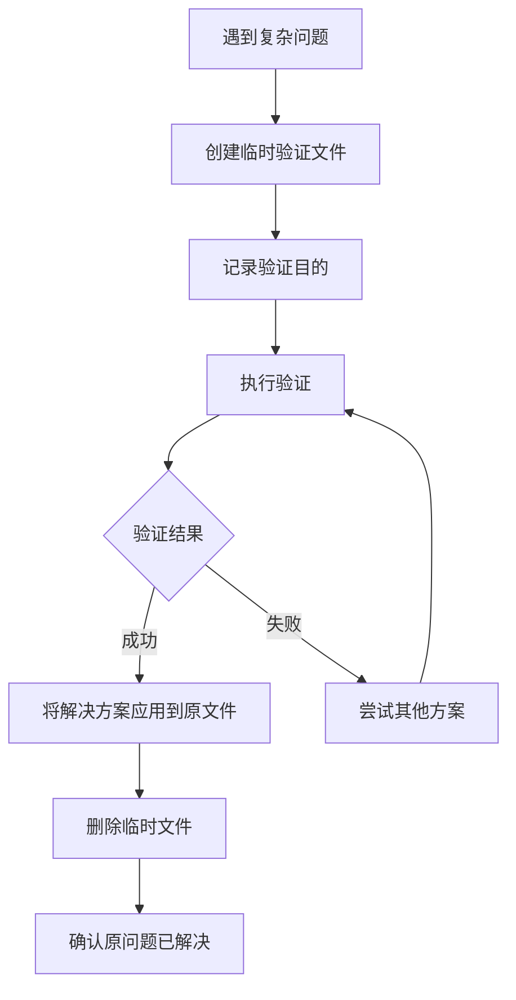

# 验证文件协议 - 允许但必须管理

## 核心原则：验证是手段，不是目的

### ✅ 允许创建临时验证文件

创建临时文件来验证想法是**正常且有用的**调试方法：
- 隔离问题
- 验证假设
- 测试解决方案
- 最小化复现问题

### 📋 强制执行的验证流程



### 🔍 验证文件管理规则

#### 1. 创建时必须记录
```json
// .claude/state/temp-files.json
{
  "temporary_validations": [
    {
      "file": "simple-auth-test.js",
      "purpose": "验证JWT token生成逻辑",
      "original_problem": "server.js中的认证失败",
      "created_at": "2024-01-15T10:00:00Z",
      "must_cleanup": true
    }
  ]
}
```

#### 2. 命名规范
- 使用明确的临时标识：`temp-`, `test-`, `validate-`, `debug-`
- 包含原始文件引用：`temp-server-auth.js` (对应 `server.js`)
- 添加时间戳：`debug-api-20240115.js`

#### 3. 验证完成后的强制步骤

##### 步骤1：应用学到的知识
```bash
# ❌ 错误：停在验证文件
"simple-server.js works! Task complete."

# ✅ 正确：应用到原文件
"simple-server.js验证成功，现在将修复应用到server.js..."
```

##### 步骤2：清理临时文件
```bash
# 验证完成后立即执行
rm simple-*.js
rm test-*.js
rm debug-*.js
git clean -f *temp*
```

##### 步骤3：验证原问题
```bash
# 确认原始问题已解决
npm start  # 运行原始server.js
npm test   # 测试原始代码
```

### 📊 验证文件追踪清单

创建临时文件时，使用此清单：

```markdown
- [ ] 记录创建原因和目标
- [ ] 标记为临时文件（命名或注释）
- [ ] 执行验证测试
- [ ] 提取可用的解决方案
- [ ] 应用到原始文件
- [ ] 测试原始文件修复效果
- [ ] 删除所有临时文件
- [ ] 更新文档（如需要）
```

### 🎯 正确的验证示例

#### 场景：API认证失败

```bash
# 1. 记录问题
echo "原问题：server.js的/api/login返回401" > .claude/debug.log

# 2. 创建验证文件
cat > temp-auth-validate.js << 'EOF'
// 临时文件：验证JWT签名问题
// 原始文件：server.js
// 创建时间：2024-01-15
// 必须删除：是

const jwt = require('jsonwebtoken');
// 简化的验证代码...
EOF

# 3. 运行验证
node temp-auth-validate.js

# 4. 验证成功，应用到原文件
# Edit server.js with the fix discovered

# 5. 测试原文件
npm test

# 6. 清理
rm temp-auth-validate.js
echo "验证完成，临时文件已清理" >> .claude/debug.log
```

### ⚠️ 常见错误模式

#### 错误1：验证文件变成永久文件
```
project/
├── server.js          # 原始文件
├── simple-server.js   # 临时验证（忘记删除）
├── test-server.js     # 另一个验证（也忘了）
└── server-working.js  # 又一个...
```

#### 错误2：验证成功就认为完成
```javascript
// simple-api.js 能工作
console.log("It works!");
// ❌ 停在这里，忘记修复 api.js
```

#### 错误3：失去原始上下文
```
创建 minimal-app.js 验证路由
→ 能工作
→ 但忘记了原始的 app.js 还有其他功能需要保留
```

### 💡 最佳实践

1. **时间盒限制**：验证文件存活不超过1小时
2. **Git忽略**：临时文件不应提交到版本控制
3. **命名约定**：让临时性质一目了然
4. **注释说明**：文件顶部说明用途和原始问题
5. **自动清理**：设置脚本定期清理temp文件

### 🔄 验证生命周期

```
创建(Create) → 记录(Track) → 验证(Validate) → 应用(Apply) → 清理(Clean) → 确认(Verify)
```

每个临时文件都必须完成完整生命周期。

### 📝 总结

- **验证文件是工具，不是产品**
- **可以创建，但必须管理**
- **验证的目的是修复原始问题**
- **清理是验证流程的必要部分**

记住：临时文件就像脚手架，建筑完成后必须拆除。